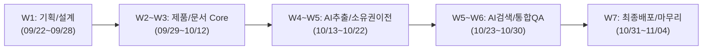

# 디지털 제품 여권 (노트북 MVP) WBS (Work Breakdown Structure)

## 1. 프로젝트 개요

- **프로젝트명**: 디지털 제품 여권 (노트북 대상 MVP)
- **개발 기간**: 2026.09.22 ~ 2026.11.04 (총 44일)
- **핵심 목표**: 노트북 중심의 생애주기 관리(`구매 → 등록 → 점검/수리/교체 → 소유권 이전`) 및 AI 문서 정보 추출·자연어 검색 파이프라인 완성
- **공수 단위**: Day (1d = 1일 작업량)

---

## 2. 프로젝트 마일스톤

---

## 3. 상세 작업 분류 체계 (WBS)

| 단계 (Phase) | 작업 패키지 (Task) | 세부 구현 작업 내용 | 담당 | 선행 작업 | 시작일 | 종료일 | 공수 | 산출물 / 완료 기준 |
| :--- | :--- | :--- | :---: | :---: | :---: | :---: | :---: | :--- |
| **기획 및 설계** | 노트북 도메인 정의 | - 노트북 필수 속성(제조사, 모델명, 시리얼번호, 세부사양) 정의 - 이력 이벤트 타입(구매/점검/수리/부품교체/양도) 정의 | 기획/공통 | - | 09/22 | 09/24 | 2d | 기능명세서 (SRS) |
| | RDB 스키마 설계 | - User, Product, Event, Document, OwnershipTransfer ERD 작성 - DDL 스크립트 작성 및 인덱스/FK 제약 조건 설정 | BE | 노트북 도메인 정의 | 09/24 | 09/26 | 2d | ERD 다이어그램, `schema.sql` |
| | REST API 명세 정의 | - 도메인별 Request/Response DTO 명세 및 상태 코드 정의 - Swagger(Springdoc) 연동 스펙 작성 | BE | RDB 스키마 설계 | 09/26 | 09/28 | 2d | OpenAPI 명세서 |
| | 와이어프레임 설계 | - 4개 핵심 뷰(등록/타임라인/문서검수/양도) 화면 흐름도 작성 | FE | 노트북 도메인 정의 | 09/24 | 09/27 | 3d | UI 와이어프레임 |
| **환경 및 인프라** | Spring Boot 베이스 세팅 | - Spring Boot 패키징 구조 수립 - 공통 Response 포맷, Global Exception Handler 구현 | BE | - | 09/25 | 09/27 | 2d | 공통 모듈 코드 베이스 |
| | 빌드 및 배포 자동화 | - GitHub Actions 기반 Gradle Build & Unit Test 자동화 - Docker 이미지 빌드 및 서버 배포 스크립트 작성 | DevOps | Spring Boot 세팅 | 09/27 | 09/29 | 2d | `.github/workflows` 파이프라인 |
| **제품 및 이력 관리 (Core)** | 노트북 등록/조회 API | - 노트북 기본 정보 등록 및 중복 시리얼 검증 로직 - 사용자별 보유 제품 목록/상세 조회 API 구현 | BE | API 명세, 베이스 세팅 | 09/29 | 10/02 | 3d | Product API 컨트롤러 |
| | 노트북 등록/목록 UI | - 노트북 스펙 입력 폼 (유효성 검증 포함) - 마이페이지 보유 기기 카드 리스트 UI | FE | 와이어프레임 | 09/30 | 10/03 | 3d | 제품 등록/목록 화면 |
| | 이력 생성 API | - 점검, 수리, 부품 교체(SSD/RAM/배터리) 이력 CRUD API - 이전 스펙 대비 변경 내역 로깅 처리 | BE | 노트북 등록 API | 10/02 | 10/05 | 3d | Event API 컨트롤러 |
| | Git 스타일 타임라인 UI | - 시간순 정렬 기반 커밋 로그 스타일의 타임라인 렌더링 - 이벤트 타입별 뱃지(수리/교체 등) 및 세부 변경점 토글 | FE | 노트북 등록 UI, 이력 API | 10/04 | 10/08 | 4d | 타임라인 컴포넌트 |
| **문서 관리 & AI 추출** | 문서 업로드 및 권한 | - 영수증/수리명세서 이미지 파일 업로드/다운로드 구현 - 문서별 공개/비공개 접근 플래그 처리 | BE | 노트북 등록 API | 10/07 | 10/10 | 3d | Document Storage 모듈 |
| | AI 추출 파이프라인 | - 이미지 대상 Vision OCR/LLM API 연동 - 모델명, 구매처, 결제금액, 구매일자 JSON 구조화 파싱 | BE/AI | 문서 업로드 | 10/09 | 10/13 | 4d | AI Extraction 서비스 |
| | 정보 검수 확정 UI | - 원본 이미지 뷰어와 AI 추출 폼 좌우 분할 배치 - 추출값 수정 후 이력 자동 생성 연계 로직 구현 | FE | AI 추출 파이프라인 | 10/12 | 10/16 | 4d | 문서 검수 확정 화면 |
| **소유권 이전 시스템** | 일회성 링크/QR 생성 | - 양도용 일회성 UUID 토큰 생성 및 만료 시간(24시간) 처리 - 토큰 기반 양도 전용 단축 URL 및 QR 코드 생성 | BE | 노트북 등록 API | 10/15 | 10/17 | 2d | TransferToken API |
| | 소유권 전환 트랜잭션 | - 새 소유자 수락 요청 시 제품 소유권 변경 트랜잭션 - 기존 양도 토큰 즉시 무효화 및 소유권 변경 이력 기록 | BE | 일회성 링크/QR 생성 | 10/17 | 10/20 | 3d | 양도 트랜잭션 로직 |
| | 이전 소유자 정보 분리 | - 이전 소유자의 이름, 결제정보, 연락처 DTO 레벨 마스킹 - 소유권 이전 후 기존 비공개 영수증 문서 열람 차단 | BE | 소유권 전환 트랜잭션 | 10/19 | 10/22 | 3d | 개인정보 마스킹 필터 |
| | 양도 및 수락 화면 | - 판매자용 QR 생성 모달 UI - 구매자용 소유권 수락 및 제품 인수 확인 페이지 | FE | 소유권 전환 트랜잭션 | 10/18 | 10/22 | 4d | 소유권 인수인계 UI |
| **제품 이력 자연어 검색** | 질의 컨텍스트 인덱싱 | - 제품 타임라인 + 공개 문서 텍스트 결합 프롬프트 구성 - 비공개 문서 데이터 프롬프트 주입 차단 로직 | BE/AI | 이력 생성 API, 정보 분리 | 10/21 | 10/24 | 3d | Prompt Builder 모듈 |
| | 자연어 Q&A 백엔드 | - 질문 입력 시 관련 이력 검색 및 답변 생성 API 연동 - 예: "배터리 교체 이력 조회", "보증 기간 만료 확인" | BE/AI | 질의 컨텍스트 인덱싱 | 10/23 | 10/26 | 3d | Product Chat API |
| | Q&A 챗봇 위젯 UI | - 제품 상세 페이지 내 Q&A 대화형 사이드바/모달 연동 - 빠른 질문 추천 칩(예: 부품 교체 이력, 보증기간) 제공 | FE | 자연어 Q&A 백엔드 | 10/24 | 10/27 | 3d | Q&A 챗봇 컴포넌트 |
| **통합 테스트 및 런칭** | 시나리오 E2E 테스트 | - 시나리오: 등록 → 영수증 AI추출 → 수리 등록 → 양도 → 질의 - 소유권 변경 후 이전 소유자 개인정보 노출 여부 전수 점검 | 공통 | 양도 UI, Q&A 챗봇 | 10/26 | 10/30 | 4d | E2E 테스트 시나리오/결과서 |
| | 운영 환경 배포/안정화 | - 운영 환경 DB 마이그레이션 및 환경변수(API Key 등) 분리 - 모니터링 로그 및 예외 알림 세팅 | BE/DevOps | 빌드/배포 자동화, E2E | 10/29 | 11/01 | 3d | 프로덕션 배포 완료 |
| | 결함 조치 및 데모 준비 | - 크로스 브라우징, 입력값 예외 처리, UI 깨짐 현상 수정 - 데모 시연 시나리오 스크립트 작성 및 최종 리허설 | 공통 | E2E 테스트 | 11/01 | 11/04 | 3d | 최종 데모 시연 준비 |
